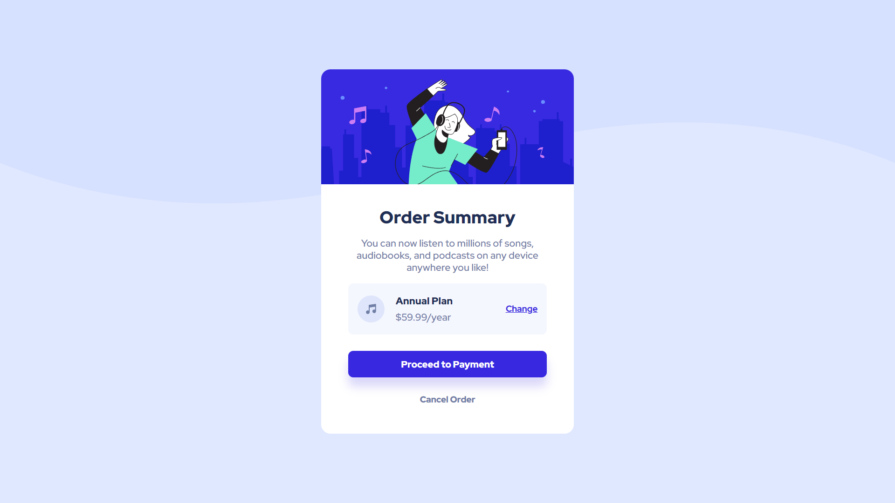

# Frontend Mentor - Order summary card solution

This is a solution to the [Order summary card challenge on Frontend Mentor](https://www.frontendmentor.io/challenges/order-summary-component-QlPmajDUj).

## Table of contents

- [Overview](#overview)
  - [Screenshot](#screenshot)
  - [Links](#links)
- [My process](#my-process)
  - [Built with](#built-with)
  - [What I learned](#what-i-learned)
  - [Continued development](#continued-development)
- [Author](#author)

## Overview

### Screenshot



### Links

- Solution URL: [Github Repository](https://github.com/Luka-khokhashvili/order-summary-card)
- Live Site URL: [Github Page](https://luka-khokhashvili.github.io/order-summary-card/)

### Built with

- Semantic HTML5 markup
- CSS custom properties
- Flexbox
- Media Query
- Mobile Responsive Design
- Custom ```root:``` color variables

### What I learned

Using media query and responsive units properly. making clean hover effects and styleing pages more effeciently.

Also i started building cleanier css code
```css
.plan-container, .payment-button {
  content...
}
```

### Continued development

I am already pretty skilled in using css and html. but I'm still working on myself and improveing my html and css skills, as well as clean code writing skills

## Author

- Website - [My Portfolio](https://luka-khokhashvili.github.io/Portfolio/)
- LinkedIn - [@luka-khokhashvili](https://www.linkedin.com/in/luka-khokhashvili-8179b7285/)
- GitHub - [@Luka-khokhashvili](https://github.com/Luka-khokhashvili)

